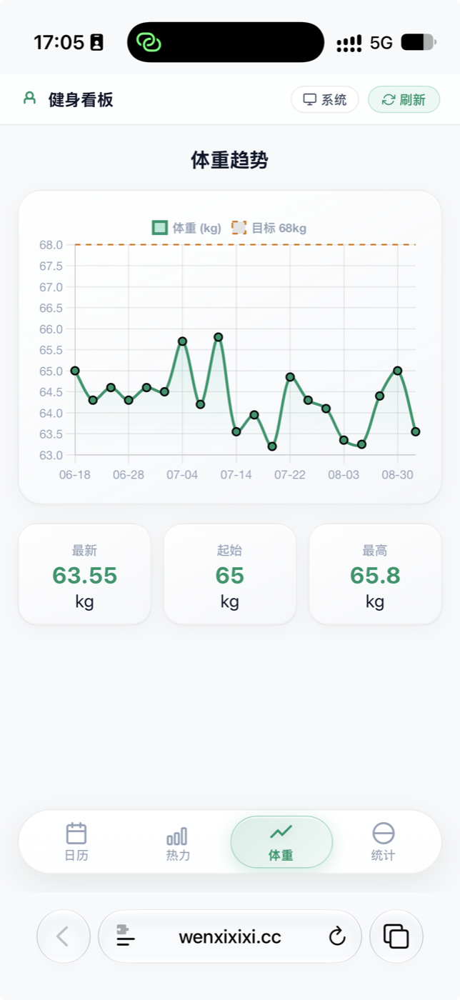
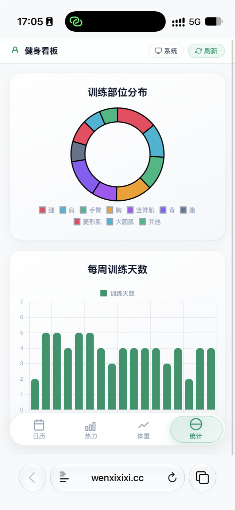

# 🏋️ Fitness Viz

健身数据可视化面板 — 把 Markdown 健身日志变成日历、热力图、体重趋势和肌肉高亮图。

**在线演示**：https://wenxixixi.cc/fitness/

**当前版本**：v3.0.0（详见 [CHANGELOG.md](CHANGELOG.md)）


## 📸 界面预览

| 日历视图 | 年度热力图 |
| :---: | :---: |
|  |  |
| **体重趋势** | **训练统计** |
|  |  |
| **训练详情（动作卡片）** | **解剖肌肉图解（正面 / 背面）** |
|  |  |

> 截图取自 iPhone Safari（跟随系统 = 浅色模式）。页面支持 🌙 暗夜 / ☀️ 浅色 / 🖥️ 跟随系统 三态主题切换。

## ✨ 功能

- 📅 **月历视图** — 彩色胶囊条标记训练部位，点击查看详情，可下滑关闭
- 🔥 **热力图** — GitHub 连续时间织锦式年度热力图（7 行 × N 周），格子可点击看当天详情，附四宫格指标卡与月度训练密度分析
- 📈 **体重趋势** — 折线图 + 体脂率线（可选），目标线自动从日志读取
- 📊 **训练统计** — 部位分布环形图 + 每周天数柱状图
- 🫀 **肌肉可视化** — MuscleWiki 级解剖矢量人体，16 大核心肌群高亮、正反面无感切换、按当天训练自动判定主训练面
- 🍽️ **饮食分析** — 自动解析饮食数据，三大宏量营养素占比条，按增肌/减脂阶段判断是否达标
- 🖥️ **桌面端适配** — ≥768px 自动扩展为 1040px 桌面仪表盘，统计图左右并排、详情升级为中央晶体弹窗
- 🎛️ **多态主题** — 暗夜 / 浅色 / 跟随系统，localStorage 持久化

## 🛠 技术栈

- **数据解析**：Python 脚本，Markdown → JSON
- **前端**：Alpine.js + Chart.js + 手写日历/热力图
- **部署**：Nginx 静态文件托管（开启全局 Gzip）
- **更新**：cron 每 10 分钟自动跑解析脚本（SHA256 增量跳过 + flock 互斥锁）

## 🚀 快速开始

### 1. 准备健身日志

用 Markdown 记录，格式参考 [fitness-logging skill](skills/fitness-logging.md)：

```markdown
### 2026-07-13（周日）
**💪 今日训练：腿**
- 杠铃深蹲 | 4组 | 80kg×5×4
- 俯卧腿弯举 | 4组 | 30kg×10×2

### 饮食
- 鸡蛋 ×2 | 150kcal | 蛋白12g | 碳水1g | 脂肪10g
```

### 2. 配置动作映射

编辑 `exercise_map.json`，已有 50+ 常见动作。遇到新动作时 `auto_map.py` 自动推理。

### 3. 运行解析

```bash
python3 parse_fitness.py
```

输出 `data.json`。

### 4. 部署

```bash
fitness/
├── index.html
├── css/fitness.css
├── img/body-outline.svg
├── data.json
├── exercise_map.json
└── exercise_map_pending.json
```

```bash
cd fitness && python3 -m http.server 8080
```

## 🤖 Hermes AI 集成

本项目配套 Hermes Agent 技能，可直接用 AI 记录健身数据：

**`skills/fitness-logging.md`** — 规范记录格式
- 训练动作记录、体重、饮食等统一格式
- 解析器自动提取，网页自动同步

**`skills/exercise-mapping-assistant.md`** — 自动映射新动作
- 遇到未映射动作自动推理肌肉群
- 高置信直接写入，低置信待人工确认

## 📁 文件说明

| 文件 | 用途 |
|------|------|
| `parse_fitness.py` | Markdown 解析器，输出 JSON（SHA256 增量 + flock 互斥） |
| `auto_map.py` | 未映射动作自动推理 |
| `safe_write_fitness.sh` | 写入守卫：内核锁 + 校验 + 失败回滚 |
| `index.html` | 前端单页（Alpine.js + Chart.js） |
| `css/fitness.css` | 样式（暗夜 / 浅色 / 跟随系统三态） |
| `img/body-outline.svg` | 解剖级人体肌肉矢量图（16 肌群高亮） |
| `exercise_map.json` | 动作→肌肉映射表（50+ 动作） |
| `docs/screenshots/` | 界面预览截图 |
| `ARCHITECTURE.md` | 架构文档 |
| `CHANGELOG.md` | 更新日志 |
| `skills/` | Hermes Agent 配套技能 |

## 📄 License

MIT
